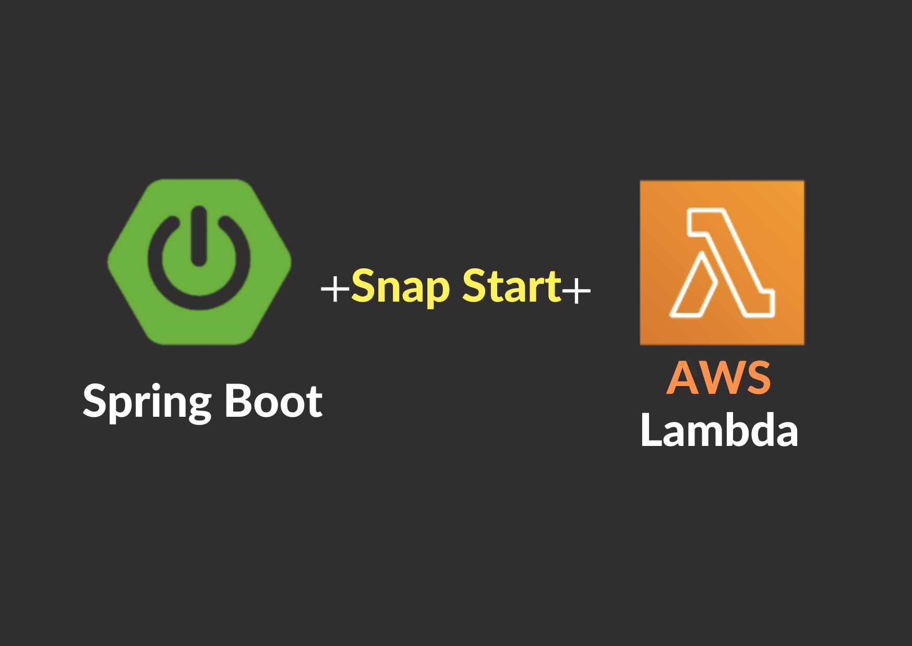
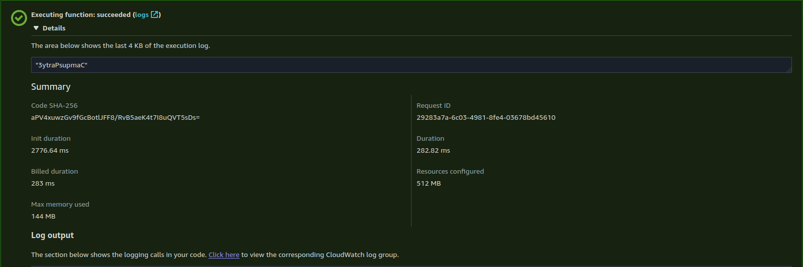
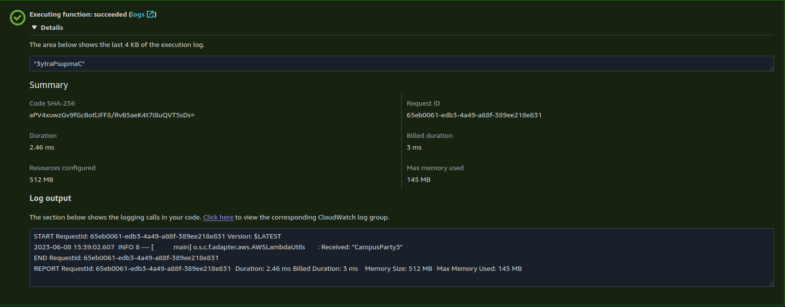
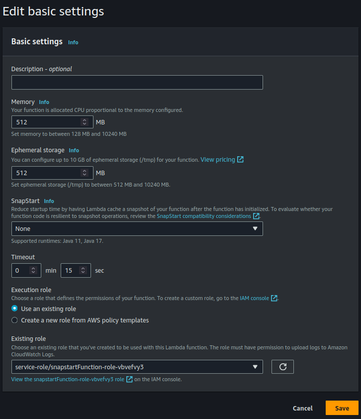
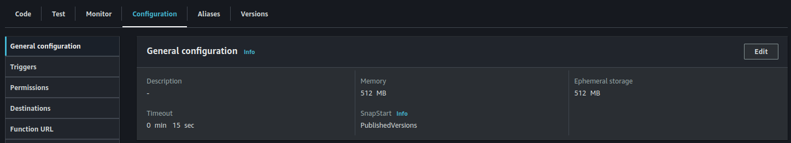
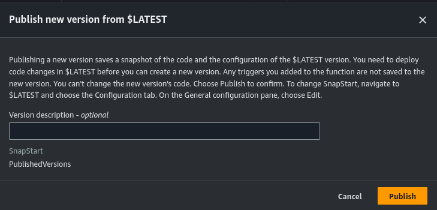
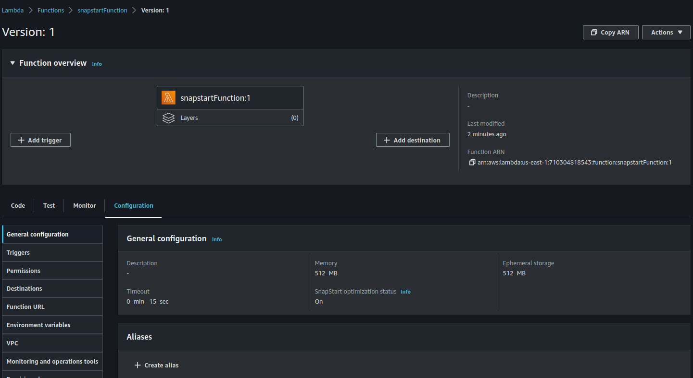
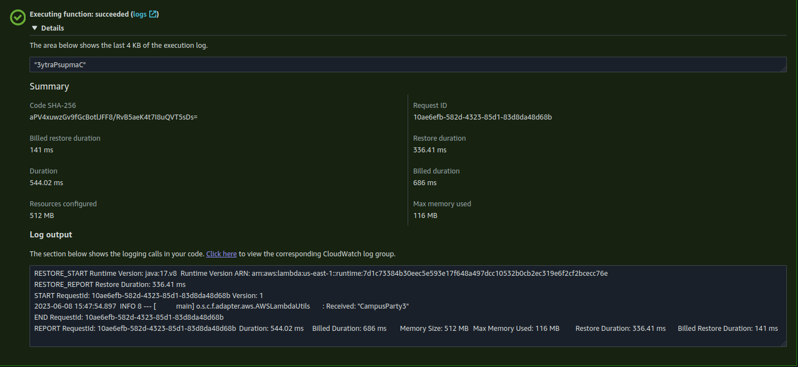
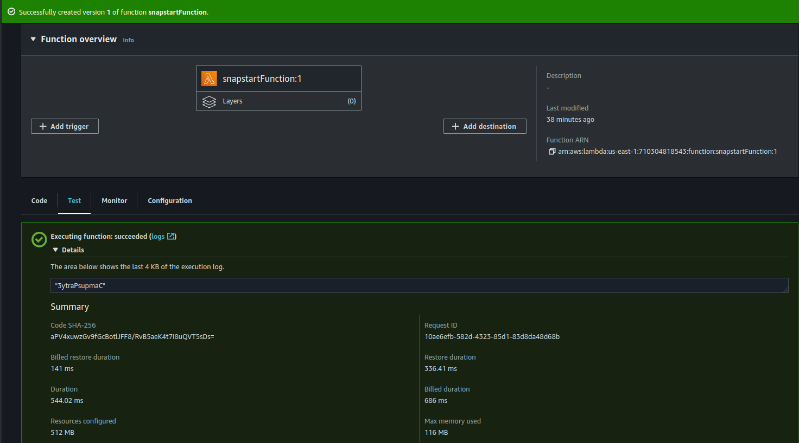

# AWS Lambda SnapStart + Spring Cloud Function 

This is a tutorial made for a talk at #campusParty3 GYN2023, you will learn about AWS Lambda SnapStart and how you can leverage it as a Spring developer.

AWS Lambda SnapStart is a new performance optimization developed by AWS that can significantly improve application startup time.

This feature provides up to 10x faster function initialization times for latency-sensitive Java applications at no additional cost and with minimal or no code changes.

## Spring boot + Spring Cloud Function + AWS Lambda SnapStart + AWS Lambda

### Start (Create Function Chack Init Duration in Test Execution)

### Start (Second Execution)

### Enable SnapStart 

### Check Enable SnapStart

### Publish Version Function with SnapStart Enable

### SnapStart Enable(On)

### Check Enable SnapStart

